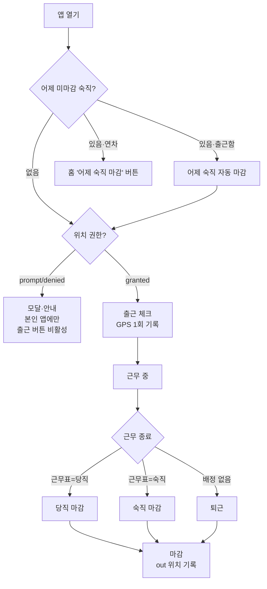

# 근태·위치 시스템 (출근체크) — PRD & 플로우

_최초 작성 2026-07-21. 출근체크·근무종료·위치 기록·관리자 출근부를 한 문서로 정리._

## 1. 목적

- **출근/퇴근을 폰에서 1탭으로** 기록한다. 별도 단말기·지문 없이 현장 기사도 쓰게.
- **가까운 기사 우선 배정**을 위해 위치를 몇 시점에만 가볍게 잡는다 (상시 추적 아님).
- 당직·숙직 근무를 근무표와 연동해 **기사가 매번 고르지 않게** 한다.
- 관리자는 **누가 출근했나 / 위치를 켰나 / 근무 중인데 앱을 오래 안 봤나**를 한눈에 본다.

설계 원칙: *감시가 아니라 이상 신호*. 기사에겐 위치를 왜 쓰는지 담백하게 알리고,
관리자 경고(오래 미확인 등)는 **관리자에게만** 보인다.

---

## 2. 데이터 모델

### attendances (하루 1행 / 사람)
| 컬럼 | 뜻 |
|---|---|
| `profile_id`, `work_date` | **UNIQUE** (하루 1행). upsert `onConflict: profile_id,work_date` |
| `checked_in_at` | 출근 시각 |
| `checked_out_at` | 근무 종료(퇴근·당직·숙직) 시각 |
| `status` | `null`(근무 중) · `퇴근` · `당직` · `숙직` |
| `lat` / `lng` / `located_at` | **출근 위치** (GPS) |
| `out_lat` / `out_lng` | **근무 종료 위치** (GPS) |

`work_date`는 KST 기준 (`TODAY_STR = toLocaleDateString("sv-SE", {timeZone:"Asia/Seoul"})`).

### profiles (위치·근무 관련 컬럼)
| 컬럼 | 뜻 |
|---|---|
| ~~`share_location`~~ | (2026-07-21 폐기) 위치 공유 토글을 없애고 위치를 항상 사용(권한 필수)으로 단순화. 컬럼은 007 정리 때 제거 |
| `geo_perm` / `geo_perm_at` | 브라우저 위치 권한 상태 보고 (`granted`/`denied`/`prompt`) — **권한이 없으면 출근 불가** |
| `last_lat` / `last_lng` / `last_loc_at` / `last_loc_label` | **마지막 확인 위치** — 배정 거리 계산 기준 |
| `last_seen_at` | 앱(홈)을 마지막으로 연 시각 |
| `duty_order` / `duty_modes` | 당직 순번 / 근무제(주5일·주4일) |

---

## 3. 위치 정책 — 두 갈래로 나뉜다

**위치는 항상 사용(권한 필수)** — 위치 권한을 켜야 출근할 수 있다(2026-07-21). 위치 공유 on/off 선택은 없앰.

| 종류 | 언제 | 어디에 저장 | 성격 |
|---|---|---|---|
| **GPS 위치** | 출근 · 대기 중 자동 · 근무 종료 | `attendances.lat/out_lat`, `profiles.last_*` | 위치정보 (권한 필요) |
| **현장 좌표** | 현장 도착 · 처리완료 | `profiles.last_*` (그 현장 좌표) | 업무 기록 (GPS 아님) |

- **배정 기준**은 `profiles.last_lat/lng` (haversine 최단거리). 출근 GPS·현장 좌표가 이 값을 갱신한다.
- **퇴근 위치(out_lat/lng)는 배정에 안 쓴다** — 퇴근하면 배정 대상이 아니므로.
- 웹은 **백그라운드 위치 불가** — 앱이 포그라운드일 때만 잡는다.

### 위치가 잡히는 5시점
```
출근 ──▶ (출동 응답) ──▶ 현장 도착 ──▶ 처리완료 ──▶ 근무 종료
 GPS       GPS             현장 좌표      현장 좌표       GPS
        + 대기 중 자동(앱 열림·2시간마다)
```

---

## 4. 플로우

### 4-1. 기사 하루



### 4-2. 근무 종료 — 근무표대로 뜬다
오늘 본인 `duty_schedules`를 보고 버튼이 자동으로 정해진다 (기사가 당직/숙직을 매번 고르지 않음).

| 오늘 근무표 | 접힌 버튼 | 펼친 버튼 |
|---|---|---|
| 당직 배정 | 🏠 근무 종료하기 (오늘 당직) | **[당직 마감]** [퇴근] [취소] |
| 숙직 배정 | 🏠 근무 종료하기 (오늘 숙직) | **[숙직 마감]** [퇴근] [취소] |
| 배정 없음 | 🏠 근무 종료하기 | [퇴근] [취소] |

- 당직=초록, 숙직=파랑 (근무표 색과 통일). 교환하면 `duty_schedules`가 바뀌므로 버튼도 따라감.
- 배정됐어도 **퇴근** 옵션은 남긴다(사정상 못 서는 경우). 이땐 status=`퇴근`으로 남아 관리자가 근무표와 다름을 안다.
- 근무 종료 버튼은 **출근 후 언제든** 누를 수 있다(시간대 제한 없음). 2단계(눌러야 선택지 열림)라 오터치는 방지.
- 버튼을 누르면 GPS를 받느라 몇 초 걸리므로 **"위치 확인 중…"** 표시 + 버튼 잠금.

### 4-3. 숙직 익일 마감 (자정 넘김 처리)
숙직은 밤샘 후 마감을 못 눌러 어제 행이 미마감으로 남는다. 오늘 조회엔 어제 행이 안 들어오므로
`pendingNight`으로 따로 조회(어제 근무표=숙직 + 미마감)한 뒤:
- **익일 출근** 시 → 출근 버튼이 어제 숙직을 먼저 자동 마감(`status=숙직`) 후 오늘 출근
- **오늘 연차·미출근** 시 → 홈 상단 **"🌙 어제 숙직 마감하기"** 버튼으로 수동 마감
- 당직은 당일 마감이라 대상 아님. 자동 마감 시각은 익일 출근 시각.

### 4-4. 근무 중 배지
- 낮: `근무 중` (파랑)
- **정규 퇴근시간(17:30) 이후** + 오늘 당직/숙직 배정: `당직 중`(초록) / `숙직 중`(파랑)으로 전환

---

## 5. 관리자 (홈 '오늘 출근' 카드 + 인사관리 출근부)

- **오늘 출근 N/M명** — 명단, 출근/마감 시각, 위치 권한 상태
- **위치 미설정 N명** 배지 — `geo_perm`이 granted 아닌 사람 (안내는 각자 앱 모달로, 게시판 노출 X)
- **2시간+ 미확인 N명** (빨강) — 근무 중인데 앱을 2시간+ 안 봄. *관리자에게만* 보임
- **출근부** (인사관리 탭): 일별(출근/마감/퇴근위치/마지막위치/마지막접속) · 월별 매트릭스(●출근 ◆당직 ▲숙직)

---

## 6. 점검 결과 (2026-07-21)

프론트 흐름 + DB 스키마 + 마이그레이션 정합성을 점검했다.

### ✅ 정상 확인
- `attendances(profile_id, work_date)` **UNIQUE 제약 존재** → upsert 안전
- 코드가 쓰는 컬럼 전부 마이그레이션·실DB에 존재
- upsert가 기존 컬럼을 날리지 않음 (출근→퇴근 시 checked_in_at·lat 보존)
- 위치 분기(출근 lat vs 퇴근 out_lat), 퇴근/미출근 위치 미조회 가드 — 의도대로

### 🔧 수정 완료
1. **[높음] 대기중 자동 위치갱신 무한 루프** — `updateLastLocation`이 `setProfilesAll`로 바꾼
   `profilesAll`이 effect deps에 있어 재실행→재갱신 폭주. 최신값을 ref로 읽고 deps를 `profile`만
   두어 차단. (검증: 12초간 profiles PATCH 4회로 안정)
2. **[높음] TODAY_STR 자정 고착** — 모듈 로드 시 1회만 계산돼 PWA를 하루 넘게 켜두면 어제로 굳음.
   KST 날짜 변경을 감지하면 리로드로 재평가.
3. **[중간] feed_read_at lazy query** — `.then()` 없어 전송 안 됨 → 추가.
4. **[중간→해결] 새벽 숙직 마감 날짜 꼬임** — 아래 4-3 방식으로 해결. 익일 출근 시 어제 숙직
   자동 마감, 연차·미출근이면 홈 버튼. (검증: 자동·버튼 마감 둘 다 어제행 status=숙직 확인)
5. **위치 공유 토글 제거** — 공유 개념을 없애고 위치 항상 사용(권한 필수)으로 단순화.

### ⚠️ 알려진 이슈 — 상의 필요 (미수정)
1. **iOS permissions API 미지원** [중간] — `navigator.permissions.query`가 없으면 `geo_perm`이
   `unknown`으로 남아, 위치 안 켠 iOS 기사가 관리자 집계에서 누락되고 **출근 버튼도 막히지 않는다**
   (권한 필수 정책이 iOS에선 강제되지 않음). **대안**: iOS는 출근 시 `getCurrentPosition` 결과로
   상태를 추정. 권한 필수로 바꾸면서 우선순위가 올라간 이슈.
2. **last_seen_at 갱신 시점** [낮음] — AttendanceBar 마운트 시에만 갱신 → 앱을 계속 켜둔 근무자가
   '2시간+ 미확인'으로 오탐될 수 있다. 위치 refresh와 함께 갱신하면 정확해짐.
3. **afterShiftEnd(17:30)·시각 표시가 기기 로컬 TZ** [낮음] — `work_date`는 KST로 맞췄으나 이 게이트는
   기기 시간대 의존. 국내 기기 가정 시 실무 영향 낮음.

---

## 7. 관련 파일

| 관심사 | 파일 |
|---|---|
| 출근바·근무종료·위치모달·관리자 출근카드 | `app/components/tabs/HomeTab.jsx` |
| handleAttendance·closeNightDuty·위치 헬퍼·대기중 자동갱신·자정 리로드·숙직 pendingNight 조회 | `app/components/ElevatorFieldApp.jsx` |
| 출근부(일별·월별) | `app/components/admin/AttendanceAdmin.jsx` |
| 마이페이지(연차 신청·알림 설정) | `app/components/MyPage.jsx` |
| 컬럼 매핑 | `lib/mappers.js` (`mapAttendance`) |
| 마이그레이션 | `supabase/migrations/025,035,040~044` |
