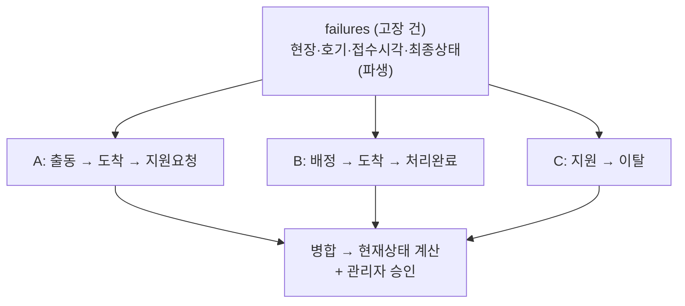

# 고장 처리 재설계 — 액션 로그 + 병합 모델 (제안)

_2026-07-22 초안. 차호근·클로드 논의 정리 → ssj910-design 상의용._
_수정 요청 아님. 방향(데이터 모델)을 먼저 합의하고 진행하기 위한 제안._

## 1. 배경 — 왜 바꾸나

지금은 **"고장 1건 = 담당자 1명 + 결과 1세트"** 모델이다.

```
failures 1행 → assignee 1명, process_result·symptom·cause… 1세트
지원요청 = assignee를 null로 (A가 빠지고 → 미배정 → B가 가져감)  ← 2026-07-21 구현
```

**한계:** 한 고장에 여러 기사가 관여하는 순간 무너진다.
- A가 지원요청했는데 **A는 현장에 남고** B가 합류 → 2명 동시 → `assignee` 칸 1개라 표현 불가
- A가 빠지고 B가 완료 → **A가 뭘 했는지 기록이 덮어써져 사라짐**
- A출동→A지원→B배정→B지원→C배정→A이탈… 분기를 상태로 다 코딩하면 경우의 수가 폭발

## 2. 제안 — 각자 등록 → 병합 (이벤트/액션 로그)

> 핵심 통찰: **상황은 복잡해도 시스템은 단순하다.**
> 상태를 직접 관리하지 말고, 각 기사가 **자기 행동만 기록**하고 현재 상태는 그 기록들에서 **파생**시킨다.



- 각 기사는 **자기 칸에 자기가 한 것만** 등록 (덮어쓰기 없음)
- 고장 이력엔 A·B·C가 한 것이 **시간순으로 다 남는다**
- "현재 이 고장 상태"는 기록들을 읽어서 **계산**

## 3. 데이터 모델

```
failures (고장 건 — 기존 유지, 슬림화)
  id, site_id, unit_id, error_code, reported_at, created_at
  status        ← 파생 상태 캐시(아래 규칙으로 계산해 저장)
  created_by    ← 최초 접수자

failure_actions (처리 기록 — 신설, 1:N)
  id, failure_id(FK), engineer_id(FK profiles)
  result        ← 이 기사의 이번 처리 결과(아래 5종)
  symptom, error_code, cause, process_content, note
  photo_urls[]
  dispatched_at, arrived_at, created_at
```

- 한 기사가 이 건에 한 번 관여 = `failure_actions` 1행. 재방문하면 행 추가.
- `failures.assignee`(단일 담당) 제거 → "활성 기사들"은 actions에서 파생.

## 4. 처리 결과 5종 (기사가 방문 후 등록)

어제 4종(처리완료/지원요청/운행정지/오신고)에 **"1차 조치"**를 추가한다.
차호근 요청: *"처리완료가 아닌 '난 내가 할 수 있는 건 다 했어요' 상태 = 이탈을 부드럽게".*

| 결과 | 뜻 | 건에 미치는 영향 |
|---|---|---|
| 🟢 **처리완료** | 고장을 해결함 | → 바로 완료 |
| 🔵 **1차 조치** | 내가 할 수 있는 조치는 했으나 완전 해결 X, 후속 필요 (부드러운 인계·이탈) | 건은 미해결 유지, 손 뗌 |
| 🟡 **지원요청** | 혼자 못 함, 인력 더 필요 | 건은 미해결, 지원미배정으로 |
| 🔴 **운행정지** | 승강기 세움(부품 대기 등) | 건은 미해결, 최우선 강조 |
| ⚪ **오신고** | 고장 아님 | → 종결 |

- **"이탈"은 별도 상태로 두지 않고 "1차 조치"로 흡수** — 아무것도 못 하고 빠지는 것도 "1차 조치(내용에 사유)"로 부드럽게. (기술 부족으로 빠짐 등)
- A가 지원요청 후 **남을지 빠질지**는 자유 — 남으면 나중에 또 액션(처리완료 등) 추가, 빠지면 "1차 조치"로 종료. 시스템은 액션만 받으면 됨.

## 5. 현재 상태 파생 규칙 (병합)

`failures.status`는 소속 `failure_actions`를 병합해 계산:

1. **처리완료 액션이 있으면** → `완료`
   - 여러 명이어도 **1명이 처리완료면 그 건은 해결** (나머지 기록은 이력으로 남음)
2. 처리완료 없고 **아직 결과 안 낸 활성 기사가 있으면** → `처리 중 (N명)`
3. 처리완료 없고 모두 손 뗌(지원요청/운행정지/1차조치)이면 → **미해결**
   - 운행정지 포함 → `운행정지`(최우선)
   - 지원요청 포함 → `지원미배정`
   - 1차 조치만 → `추가배정 필요`
4. 오신고 → `종결`

## 6. 관리자 승인 — 필수 아님 (기본: 자동 완료)

**기본은 기사가 처리완료하면 바로 완료.** 별도 승인 단계 없음(운영 단순).

```
예)  A-지원요청   B-처리완료   C-이탈(1차조치)
     → B의 처리완료로 건은 바로 '완료'
     → 이력엔 A·B·C 기록이 다 남아 흐름이 보임
```

- (선택) 나중에 오등록·조기완료가 문제되면 '완료 → 관리자 확인' 한 단계를 옵션으로 붙일 수 있음. 지금은 안 넣는다.

## 7. 리스트 대표 표시 (홈 고장현황)

파생 상태를 그대로 뱃지로:

| 파생 상태 | 뱃지 |
|---|---|
| 운행정지 | ⛔ 운행정지 (카드 강조·최우선) |
| 지원미배정 | 지원미배정 (주황) |
| 추가배정 필요 | 미배정 |
| 처리 중 (N명) | N명 처리 중 |
| 완료 | (리스트에서 빠짐 · 이력에 보존) |

+ 최근 30일 3회↑ 현장은 재발 아이콘 뱃지(어제 구현).

## 8. UI 흐름

- **기사**: 고장 카드 → "내가 출동" → 도착 → **결과입력(5종 중 선택)**. 각자 자기 기록만. 남의 기록 안 건드림.
- **호기 상세 고장이력**(`SiteTab`의 `ElevatorDetailScreen`): 그 건에 쌓인 A·B·C 기록이 **시간순 타임라인**으로 병합돼 보임. ← 이미 화면 존재, 여기에 다인 기록을 얹으면 됨.
- **관리자**: 지원미배정 건에 기사 배정 / 처리완료(승인대기) 건 승인.

## 9. 재발·품질 분석 (관리자 어드민) — 이 모델을 만드는 핵심 이유

기록 보존의 진짜 목적은 이력 조회가 아니라 **분석**이다. 같은 건물·같은 호기에서 같은 현상이
반복될 때 "누가 어떤 조치를 했고, 왜 자꾸 재발하는가"를 본다. 위치는 **관리자 콘솔(`/admin`)**.

- **재발 추적** — 같은 호기·같은 증상이 N일 내 다시 접수되는지. 호기 이력에 "이 증상 30일 내 N번째" 표시. (설비 노후인지 처리 부실인지 구분의 출발점)
- **직전 처리자 연결** — 재발 건에 `직전 처리: MM/DD OO기사(처리완료)`를 붙여, 그 처리가 부실했는지 바로 본다.
- **기사별 지표**
  - **재발률** = 내가 처리완료한 건 중 N일 내 같은 호기 재발 비율 — 낮을수록 잘 수습
  - 처리 건수 / 완료율 / 지원요청·이탈률 / 평균 처리시간(도착~완료)
  - → "A는 처리 후 자꾸 재발(대충?) / B는 처리하면 안정(제대로)"이 **숫자로** 보인다.

**톤·노출**: 기사별 지표는 사실상 평가라 **관리자만** 본다(기사 화면엔 없음 — 위치 미확인 경고와 동일 원칙).
"누가 대충하나 색출"이 아니라 **"재발 원인 파악 → 교육·지원"** 프레임. 데이터가 조용히 보여주게 둔다.

> 현재 "1건 1담당 + 결과 덮어쓰기" 모델로는 이 분석이 **원천적으로 불가능**하다(누가 뭘 했는지 안 남음).
> `failure_actions`(기사별 기록 보존)가 이 분석의 전제 — 재설계의 가장 강한 명분이다.

## 10. 마이그레이션 · 상의 포인트 (ssj910-design)

- `failure_actions` 테이블 신설 = **v2 마이그레이션 1건**. 마침 v2 재설계 중이라 `DESIGN-v2.md`에 얹기 좋음.
- 기존 `failures`의 단일 결과 컬럼(process_result 등)은 → 첫 action으로 이관하거나, 호환 위해 당분간 병행.
- 결과 5종 확정(특히 "1차 조치" 네이밍 — 대안: "조치 후 인계", "부분 조치").
- 관리자 승인 단계를 넣을지(운영 부담 vs 품질).
- **재발 판정 기준** — 같은 호기(unit_id) + 같은 증상을 뭘로 볼지(error_code / fault_error_code / 텍스트 유사). 1차는 "같은 호기 N일 내 재접수"만으로 시작하고, 증상 매칭은 데이터 쌓인 뒤 정교화.

## 11. 현재 코드와의 관계

- 2026-07-21의 "지원요청 → 미배정 전환"은 **이 모델의 1차 근사**. `failure_actions`가 생기면 그 전환은 "A가 지원요청 액션을 남기면 활성 기사에서 빠지고 건이 지원미배정으로 파생"으로 자연스럽게 대체된다.
- 어제 되돌린 "운행정지 강조·심각도 정렬"은 이 모델에서도 그대로 필요 → 재적용 대상.
